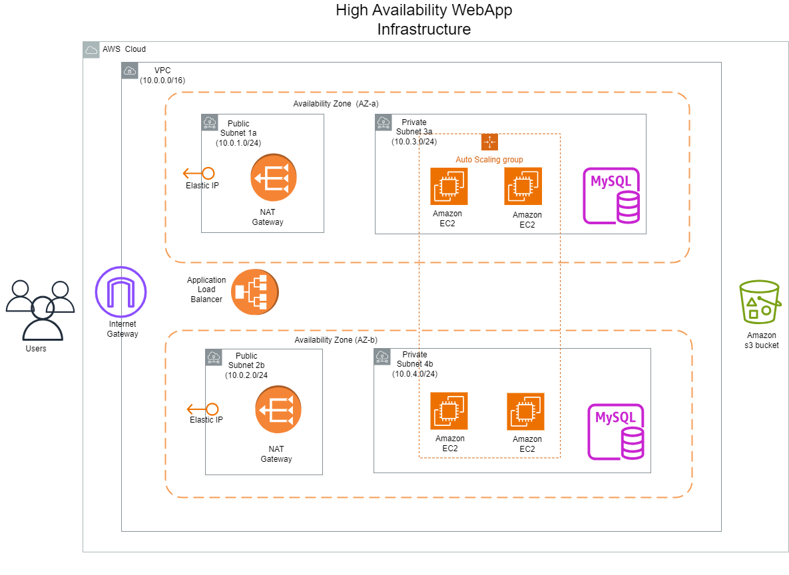

# Terraform and Cloudformation: A Comparative Study of Infrasture as Code Tools on AWS

The goal of this research project is to study and evaluate the effectiveness of these two IaC tools for automating the deployment of cloud infrastructures; and determine which is better suited using a specific case study of deploying a 'High Availability WebApp Architecture'
#
The research aims to answer the following questions:
#
• What are the neccessary software qualities that defines the effectiveness of Infrastructure as Code (IaC) tools in automating and managing cloud infrastructure ?

• What are the key features and functionalities of Terraform and AWS CloudFormation as Infrastructure as Code tools, and how do these features contribute to the ease of provisioning, managing, and scaling cloud resources on the AWS platform??

• How does AWS Cloudformation compare to Terraform?
  - Performanance: deployment time and scalability
  - Developer Experience: learnability, IDE support and community support
  - Maintainability 

#

